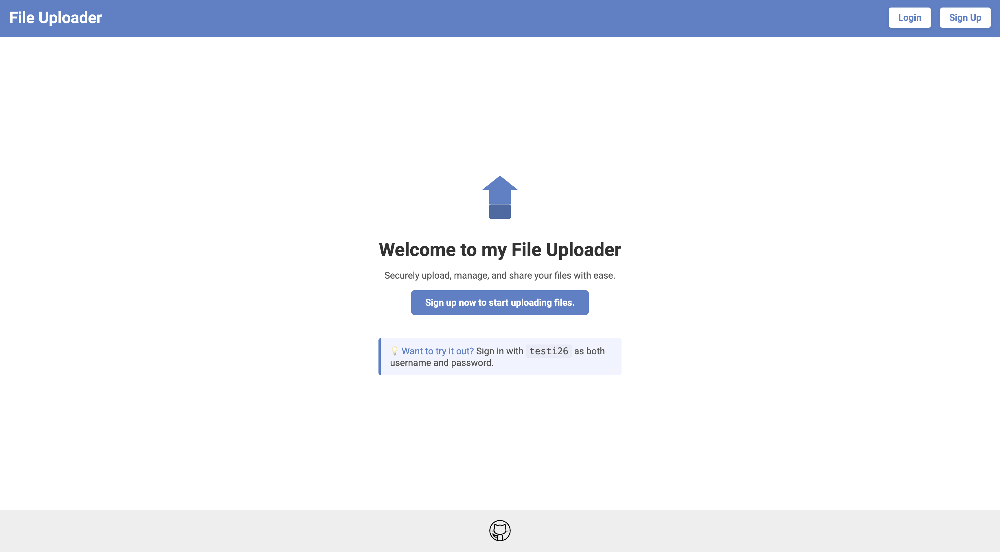
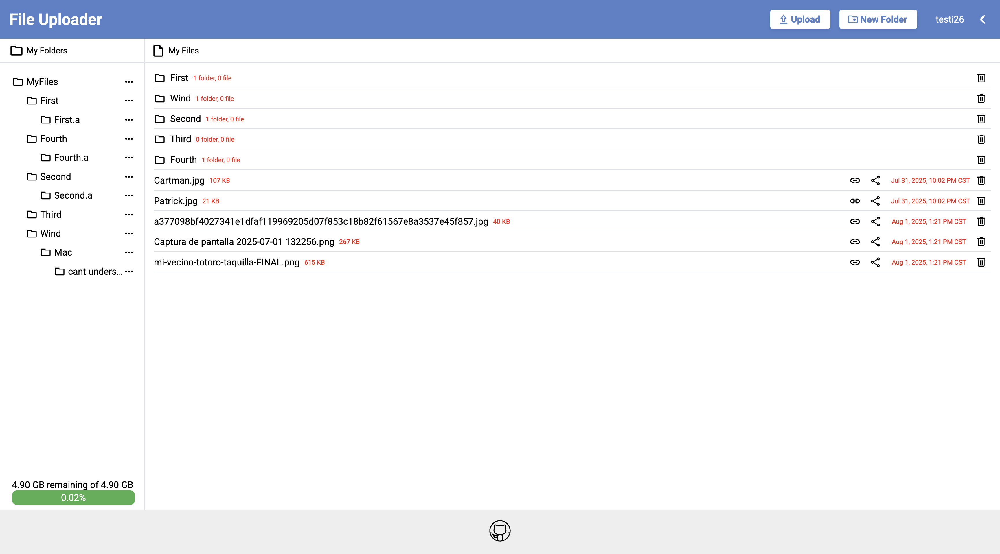
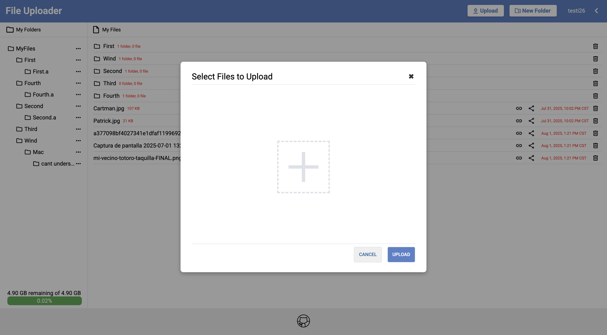
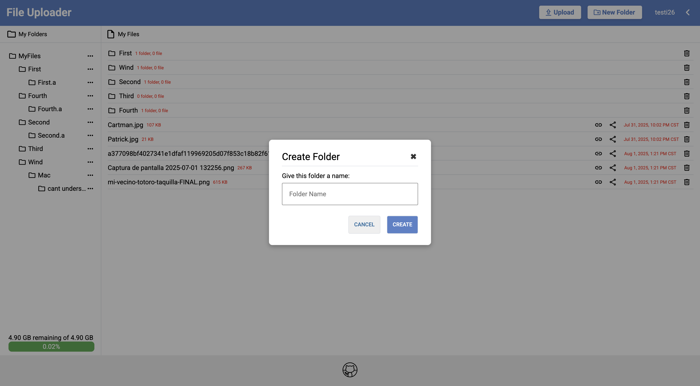

# Express & Prisma File Uploader Project

A web application built with **Express**, **Prisma**, and **Passport.js** that allows authenticated users to upload and manage files and folders, with optional cloud storage integration.


## Installation

Follow these steps to run the project locally:

1. **Clone the repository**
   ```bash
   git clone git@github.com:Maiker260/File-Uploader.git
   ```

2. **Install dependencies**
   ```bash
   cd File-Uploader
   npm install
   ```

3. Set Up Prisma

   ```bash
   npx prisma migrate dev --name init
   npx prisma generate
   ```

4.	Configure environment variables
   Create a .env file with:

   ```bash
   DATABASE_URL=“insert-database-url"
   SESSION_SECRET="insert-secret-key“
   NODE_ENV="development"

   BUCKET_REGION="insert-S3-bucket-region”
   BUCKET_NAME="insert-S3-bucket-name”
   ACCESS_KEY="insert-S3-bucket-access-key”
   SECRET_ACCESS_KEY="insert-S3-bucket-secret-key”
```

3. **Build and run**
   ```bash
   npm run devStart
   ```

4. **Open the app**  
    
## API

This project fetches data using [S3 Bucket API](https://docs.aws.amazon.com/AmazonS3/latest/API/Welcome.html/).


## Features

**Authentication**
- Session-based authentication using **Passport.js**.
- Sessions persisted in the database using **Prisma session store**.
- Only authenticated users can create, view, or manage files and folders.

**File Upload**
- Users can upload files using a **form**.
- Initial uploads are stored in the local filesystem.
- Integrated with **Multer** middleware for handling multipart/form-data.
- Files can later be stored in cloud storage (**AWS S3**) with URLs saved in the database.

**Folder Management**
- Users can **create, read, update, and delete folders**.
- Files can be uploaded into specific folders.
- Routes and database interactions are set up for full CRUD functionality.

**File Details & Download**
- View individual file details:
  - Name
  - Size
  - Upload time
- Download button to retrieve the file.

**File Sharing**
- Share files to anyone with a direct link.
- Allows anyone (authenticated or not) to access the shared folder contents temporarily.

## Demo

https://file-uploader-6gao.onrender.com


## Screenshots

Login/SignUp Page


Home Page


Upload File Form


Create Folder Form


## Acknowledgements

- [Express](https://expressjs.com/)
- [Prisma](https://www.prisma.io/)
- [Passport.js](http://www.passportjs.org/)
- [Multer](https://www.npmjs.com/package/multer)
- [AWS S3](https://aws.amazon.com/s3/)


## Author

- [@Maiker260](https://github.com/Maiker260)